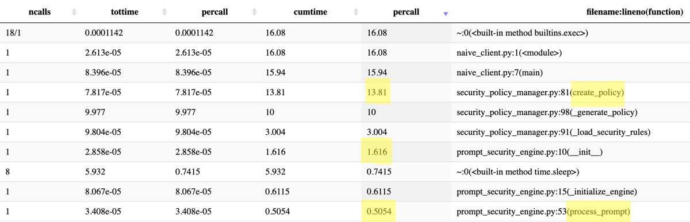
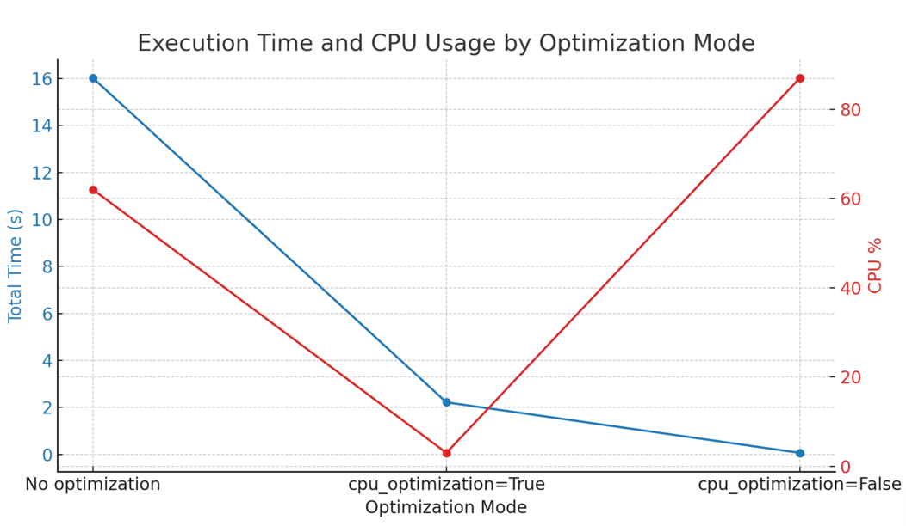

# Solution - Adir Bruchim

Final solution can be seen under sprompt/client/solution_client.py
when running main. You can choose to run with optimize_cpu=False for best time performance.

## Looking at the code and identifying hotspots
I ran cProfile to identify the most time-consuming functions in the client run
```
python -m cProfile -o output.prof client/naive_client.py 
snakeviz output.prof
```

And found the following:



---
>### create_policy 
>And more specifically _generate_policy and load_security_rules within it accounts for most of the time
We can use caching to store the specific parameters used for each of the functions to make them run faster.
<br> While we could cache `security_level` and `additional_rules` separately, allowing caching different rules under the same policy and still save some time,
There are other actions in `create_policy` involves heavy calculations on the policy itself, derived from these parameters.
<br> Therefore - I'd prefer caching the function as a whole.
<br> I made the function replacing it generic in case I'd change my mind about the other functions. 


>### prompt_security_engine
>I also noticed in the code and not from the cProfile analysis there were other `time 🥁` consuming functions in prompt_security_engine.
Both in the constructor and in the prompt processing function.
---
## Solution
>🐒-patching `create_policy` to use cached objects when passed same security_level and additional_rules.
<br>I used the generic function `cached_method_wrapper`. 

>Overriding both the constructor and the `process_prompt` functions in PromptSecurityEngine based on the policy. 
<br> Since the policy is an object - this involved pickle and therefore was a bit harsher on the cpu.
> This can be controlled using the `optimize_cpu` flag
---
## Results
### No optimization
```
sprompt time python client/naive_client.py
Generating security policy naively without caching...
[SECURITY LOG]: Initializing PromptSecurityEngine components...
[SECURITY LOG]: Sanitizing prompt...
[SECURITY LOG]: Verification passed for prompt.
[SECURITY LOG]: Extra data logging: dummy_sum=499500, result=True
Security Report:
{'prompt': 'This is a benign prompt with malicious content <script>evil()</script>', 'verification_result': True, 'policy_used': <sprompt.security_policy_manager.Policy object at 0x104bc7fb0>, 'report_generated_at': 1744728680.857287}
python3 client/naive_client.py  9.96s user 0.09s system 62% cpu 16.015 total
```

### cpu_optimization=True
```
sprompt time python client/naive_client.py
Generating security policy naively without caching...
[SECURITY LOG]: Initializing PromptSecurityEngine components...
[SECURITY LOG]: Sanitizing prompt...
[SECURITY LOG]: Verification passed for prompt.
[SECURITY LOG]: Extra data logging: dummy_sum=499500, result=True
Security Report:
{'prompt': 'This is a benign prompt with malicious content <script>evil()</script>', 'verification_result': True, 'policy_used': <sprompt.security_policy_manager.Policy object at 0x1018a3f50>, 'report_generated_at': 1744729330.924741}
python3 client/naive_client.py  0.05s user 0.02s system 3% cpu 2.220 total
```

### cpu_optimization=False
```
sprompt time python client/naive_client.py
Generating security policy naively without caching...
Security Report:
{'prompt': 'This is a benign prompt with malicious content <script>evil()</script>', 'verification_result': True, 'policy_used': <sprompt.security_policy_manager.Policy object at 0x10437f2f0>, 'report_generated_at': 1744728656.62146}
python3 client/naive_client.py  0.04s user 0.02s system 87% cpu 0.069 total
```

---
## Followup
- Use another level of cache (separate `additional_rules` and `security_level` for example) to allow other faster actions
- Split the policy and the prompts caches
